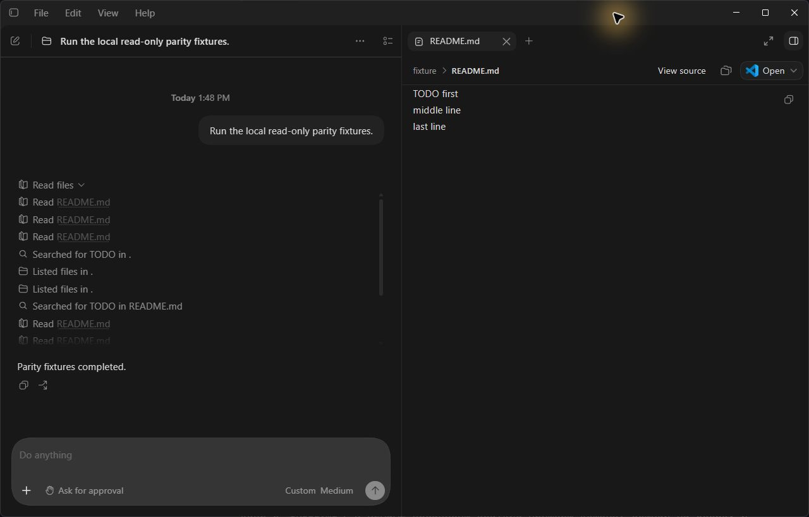

# Codex PowerShell Actions

**Readable file actions for Codex on Windows.**

[](https://github.com/samo33ddd/codex/actions/workflows/powershell-parity.yml)
[](https://github.com/samo33ddd/codex/actions/workflows/powershell-upstream.yml)

[Get a candidate build](#use-a-candidate-build) · [Compatibility](#compatibility) · [Supported commands](#what-changes) · [Verification](verification/powershell-parity.md)

An unofficial, version-pinned backend patch for **Windows x64 and PowerShell 7**. Recognized file reads, searches, and directory listings appear as structured actions in the Codex activity history, with file links where supported.

| PowerShell command | Activity |
|---|---|
| `Get-Content README.md` | Read a file and open its preview |
| `Select-String -Path README.md -Pattern TODO` | Search file contents |
| `Get-ChildItem` | List files |

## In action



*A real desktop capture: expanded PowerShell activity on the left, the file opened from a read action on the right. Captured with the English interface in an isolated test profile.*

This fork preserves the history of [openai/codex](https://github.com/openai/codex); the patch lives on `powershell-action-parity`. It is not an OpenAI release or a desktop plugin. The installed desktop resources are unchanged.

## Compatibility

| Component | Verified baseline |
|---|---|
| Windows desktop app | `26.911.7940.0` |
| Backend version | `0.155.0-alpha.2.6` |
| Upstream source tag | `rust-v0.155.0-alpha.2.6` |
| Upstream source commit | `bf6f0a4ec97919bf697cdc532e7b8af4ec482fc6` |
| Platform | Windows x64, PowerShell 7 |
| Rust toolchain | `1.95.0` |

The launcher refuses unlisted desktop versions. A newer Codex CLI release does **not** imply compatibility with a newer desktop app. Version data and the pinned official code-mode host download are recorded in [compatibility.json](scripts/powershell-parity/compatibility.json).

## What changes

- `Get-Content`, `gc`, `type`, `cat`: literal file reads, explicit path arguments, `Encoding`, `Raw`, `ReadCount`, first/last line limits.
- A narrow `Get-Content ... | Select-Object -Skip ... -First ...` pipeline preserves the read action.
- `Select-String` / `sls`, supported `rg` / `rga` / `grep` arguments, and `git grep`: content searches with preserved literal regexes.
- `Get-ChildItem` / `gci` / `dir` / `ls`, `rg --files`, and `git ls-files`: file listing; supported filename filters follow the existing search-action convention.
- Ordered literal command chains keep every recognized action. Skill-file reads use the same conservative parser.

Variables, interpolation, computed calls, redirection, directory changes, unsupported pipeline stages, and mixed read/mutation scripts remain generic commands. Classification does not execute PowerShell, expand another process's environment, change command output, or grant safety/approval privileges.

See [coverage and verification](verification/powershell-parity.md) for precise boundaries and known limits.

## Use a candidate build

[PowerShell parity Actions](https://github.com/samo33ddd/codex/actions/workflows/powershell-parity.yml) produces a candidate ZIP after the Windows checks pass. Candidates are not automatically published as releases or declared desktop-compatible. There is no automatic updater.

1. Download and extract a candidate artifact. It includes SHA-256 checksums, a build manifest, the launcher, three locally built executables, and the pinned official `codex-code-mode-host.exe`.
2. In PowerShell 7, validate the installed desktop and the extracted components:

   ```powershell
   .\Start-Codex.ps1 -ValidateOnly
   ```

3. Save your work and close Codex yourself. Then run:

   ```powershell
   .\Start-Codex.ps1
   ```

The launcher sets `CODEX_CLI_PATH` only for the new process and checks the actual backend process path. It does not close an existing session or edit account credentials, providers, models, global environment variables, WindowsApps, or app.asar.

**Rollback:** close this instance and start Codex from its usual Start-menu shortcut. The stock installation is unchanged.

## Build and verify locally

Prerequisites: Windows x64, PowerShell 7, Python 3.11+, Git, Visual Studio C++ build tools and Windows SDK, Rust/rustup, `just`, `cargo-nextest`, and `rg`. Install missing system components deliberately. The optional `Enter-BuildEnvironment.ps1` keeps Rust homes and build output under a supplied directory; it changes only the current shell environment.

From the repository root:

```powershell
# Optional isolated toolchain location; set a directory on the desired drive.
. .\scripts\powershell-parity\Enter-BuildEnvironment.ps1 -BuildRoot 'E:\codex-build-tools'
rustup toolchain install 1.95.0 --component clippy --component rustfmt --component rust-src
cargo install --locked just --version 1.58.0
cargo install --locked cargo-nextest --version 0.9.145

just test -p codex-shell-command -p codex-skills -p codex-app-server-protocol
just test -p codex-tui --lib -E 'test(exec_cell::render::tests::powershell_skill_read_snapshot)'
Push-Location codex-rs
cargo build --release -p codex-cli -p codex-windows-sandbox --bins
Pop-Location

python scripts/powershell-parity/check_app_server.py --binary "$env:CARGO_TARGET_DIR/release/codex.exe" --output .local/appserver-check
python scripts/powershell-parity/package_windows.py --binary-dir "$env:CARGO_TARGET_DIR/release" --output artifacts/codex-powershell-actions-windows-x64 --profile release
```

The public app-server check uses a loopback model fixture and a disposable `CODEX_HOME`; it executes only the explicit read-only fixture commands. It needs no API credentials. Packaging downloads the exact official code-mode host and rejects a SHA-256 mismatch. This avoids the unavailable Windows V8 archive in this source tag without disabling its sandbox.

This upstream tag normalizes local workspace package versions in Cargo.lock during builds. Do not include that unrelated normalization in a patch update. The baseline's full workspace tests also require dependencies beyond this scoped workflow.

## Branches and updates

- `main`: clean upstream snapshot; do not merge the patch here.
- `powershell-action-parity`: default branch for the patch, documentation, CI, and update checks.
- `ps-actions/0.155.0-alpha.2.6`: maintenance branch for the recorded source baseline.

The [upstream compatibility workflow](https://github.com/samo33ddd/codex/actions/workflows/powershell-upstream.yml) runs every Monday at 06:37 UTC and can be started manually with a source tag. It checks patch applicability using an isolated Git index. It never checks out or executes candidate source, rewrites a branch, pushes, or updates a desktop installation. Its summary and JSON artifact distinguish an applicable patch, an already-applied patch, and a conflict. A conflict is a report outcome, not a claim that tests passed.

For a new desktop version:

1. Identify its actual bundled backend version and confirm the override mechanism still exists.
2. Create a new version branch from the matching official source tag; cherry-pick the backend patch and adapt conflicts.
3. Carry over the delivery tooling, update compatibility metadata and the official host hash, and run Windows CI.
4. Test an isolated desktop instance: labels, ordering/grouping, actual file links, skills and relevant MCP/tools.
5. Publish a release only after recording those results. Attach the tested package, checksums, and compatibility notes; retain previous tags for rollback.

The two PowerShell workflows use standard hosted runners and do not require OpenAI's signing secrets or private runner groups. Existing fork branches and inherited workflow settings are preserved; pushing the patch branches does not trigger the upstream main-branch or tag-release workflows.

## License

[Apache-2.0](LICENSE), with the upstream [NOTICE](NOTICE) retained. Upstream documentation is available in [openai/codex](https://github.com/openai/codex/tree/rust-v0.155.0-alpha.2.6).
