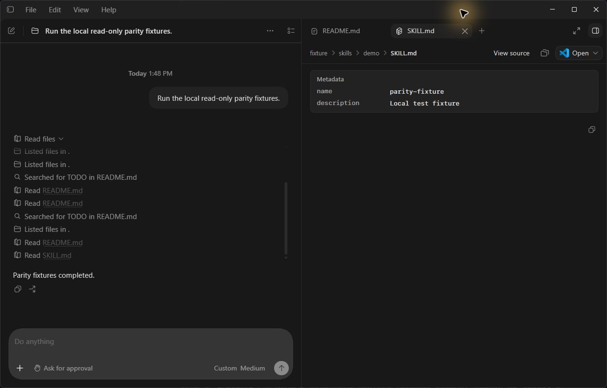

# PowerShell action parity: coverage and verification

Source baseline: `rust-v0.155.0-alpha.2.6`, commit `bf6f0a4ec97919bf697cdc532e7b8af4ec482fc6`. Desktop baseline: `26.911.7940.0`, Windows x64 / PowerShell 7.

## Coverage

| Operation | Bash/Zsh comparison | Supported PowerShell equivalent |
|---|---|---|
| Read a file | `cat README.md` | `Get-Content`, `gc`, `type`, `cat` |
| First lines | `head -n 160 README.md` | `Get-Content README.md -TotalCount 160` |
| Last lines | `tail -n 20 README.md` | `Get-Content README.md -Tail 20` |
| Line range | `sed -n '11,30p' README.md` | `Get-Content README.md \| Select-Object -Skip 10 -First 20` |
| Raw/encoding/chunks | `cat README.md` | `Raw`, `Encoding`, `ReadCount`, with explicit parameter values |
| Content search | `rg -n TODO src` | Same native command, supported `rga` / `ripgrep-all` variants |
| Cmdlet search | `grep -n TODO README.md` | `Select-String -LiteralPath README.md -Pattern TODO`, `sls` |
| Literal regex | `rg '\bTODO\b' src` | Exact single-quoted regex, without Bash unescaping |
| File inventory | `rg --files src` | Same native command |
| Directory listing | `ls src` | `Get-ChildItem`, `gci`, `dir`, `ls` |
| Filename filtering | `find src -name '*.rs'` | Supported `Get-ChildItem -Recurse -Filter '*.rs'`; represented as filename search |
| Git inventory/search | `git ls-files`, `git grep` | Same literal native commands |
| Skill read | `cat skills/demo/SKILL.md` | `Get-Content` with supported parameters |
| Ordered commands | `cat a; rg TODO src; ls src` | Equivalent literal cmdlets/native commands, preserving order |
| Read-only selection pipeline | `cat a \| head -n 20` | `Get-Content a \| select -First 20` |

Supported native reader subsets also include `bat`, `batcat`, `less`, `more.com`, `head`, and `tail`. Cmdlet names/parameters are case-insensitive; known native `.exe` spellings are supported. Windows separators, UNC paths, spaces and quoted apostrophes are retained.

Read links use the existing executor-cwd resolution contract. Search/list metadata keeps the existing shortened display-path contract; it is not a new absolute file link.

## Conservative boundary

Variables and interpolation, computed invocations, arrays/multiple read operands, provider/ADS/drive-relative paths, wildcard reads, unsupported parameters, arbitrary programs, cwd changes, general transformations, redirection and mixed mutations remain `Unknown` for the whole script.

The PowerShell implementation does not reuse the Bash parser or copy its broad Python/awk/sed heuristics. Native `awk`, `sed`, `nl`, `fd`, `find`, `ag`, `ack`, `pt`, `eza`, `exa`, `tree`, and `du` are not separately enabled; use supported PowerShell equivalents. An escaped leading parameter character cannot turn a positional value into a recognized switch.

An existing Bash discrepancy was found: `rg -e '-TODO' fixture` misidentifies its query in this baseline. PowerShell retains the correct query/path. The equivalent paired comparison uses Bash `grep -e '-TODO' fixture`; Bash behavior was not changed to force parity.

## Recorded local verification (2026-09-18)

- Original public-parser implementation: 14 paired reproductions failed before integration.
- Final coverage: 30 Bash/PowerShell public-parser pairs and 12 classifier pairs, plus conservative negative cases.
- Scoped shell-command, skills and app-server-protocol suite: **538 passed, 1 skipped**.
- Existing PowerShell skill-read TUI snapshot: **1 passed**, with 4547 unrelated tests filtered.
- Real app-server execution: **11 fixture commands, 13 actions**; started/completed metadata, output, read targets and persisted history verified on the final local binary.
- Scoped lint completed; final shell-command Clippy with `-D warnings` passed.
- Independent review identified quoted-regex and escaped-parameter cases; both were corrected and covered by the final scoped run.
- Native CLI and Windows sandbox helpers built using Rust 1.95.0. No WSL backend was used.
- The full workspace test attempt stopped before execution at `glib-sys` because `pkg-config` was unavailable. A complete workspace pass is not claimed.
- Rust/Python formatting completed. Aggregate formatting could not run the unrelated Bazel/Starlark formatter because DotSlash was absent locally.

Machine-specific paths, process IDs, disposable profile data and raw logs are not published. CI runs generate their own app-server receipts and candidate manifests.

## Live desktop verification

Read-only inspection of the installed desktop resources confirmed `CODEX_CLI_PATH` support. An isolated desktop instance then ran the patched backend; its actual executable path was checked, while the normal application remained on the stock backend.

The expanded history showed all 13 ordered read/search/list entries. The screenshots below were recaptured with the desktop's English interface, showing `Read`, `Searched`, and `Listed`. Clicking README opened the correct fixture containing `TODO first`, `middle line`, and `last line`. Clicking SKILL.md opened the correct fixture metadata.

### File reads, search and listings

### Skill document preview

The skill fixture was shown as a file read. Registered-skill detection and special TUI labeling are covered by the skills/TUI tests; the screenshot alone is not evidence of registered-skill labeling.

The temporary desktop setup initially rejected the fixture's unmanaged permission profile. Selecting `read-only` only in that disposable home resolved setup. No real user's sandbox or approval policy was changed.

App-server initialization and MCP status-list requests succeeded, and bundled Node/browser-use runtimes were resolved. The isolated test did not use authenticated third-party connectors; their end-to-end health remains unverified. Optional MCP resource-list and experimental-feature warnings were recorded.

## Distribution boundary

The locally tested package used the unchanged code-mode host shipped with the matching installed desktop. Automated packages instead download the same-version official GitHub release asset using a pinned SHA-256. These are distinct artifact origins, recorded honestly in their manifests. A CI package still requires actual desktop acceptance before release publication.

CI checks do not publish releases or automatically update installations. See the root README for launch, rollback, branch maintenance and release gates.
